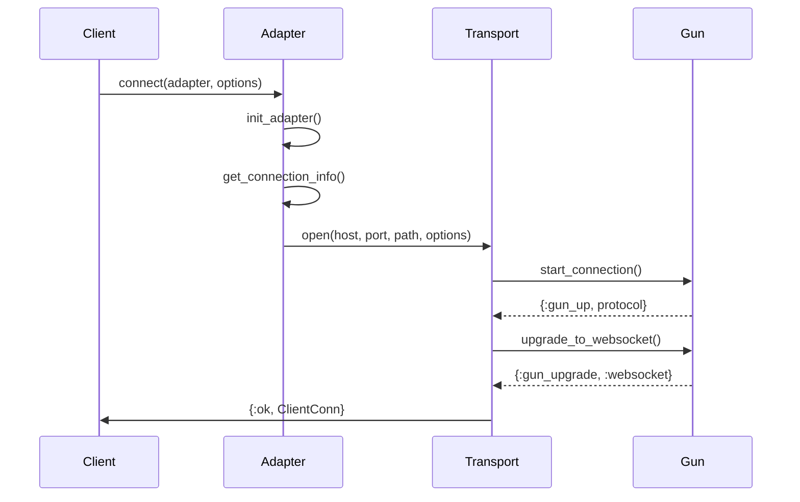
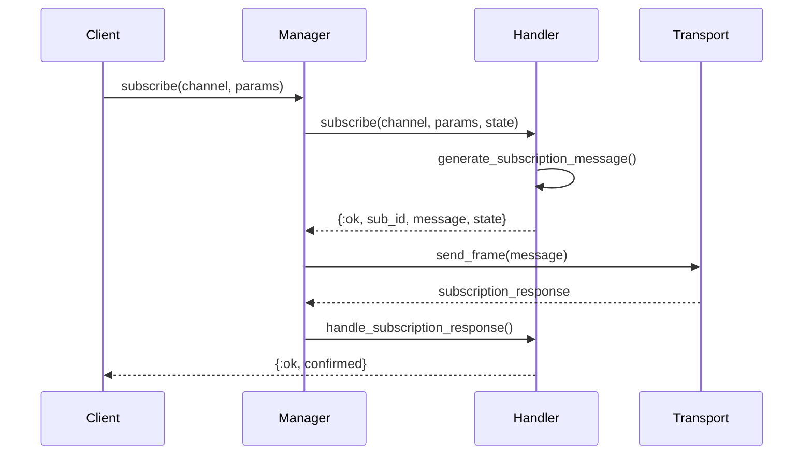

# WebsockexNova Flow Explanation

This document provides a comprehensive overview of how WebsockexNova works internally, explaining the data flow, architecture patterns, and key components.

## Table of Contents
1. [High-Level Architecture](#high-level-architecture)
2. [Configuration Precedence](#configuration-precedence)
3. [Connection Flow](#connection-flow)
4. [Message Handling Flow](#message-handling-flow)
5. [Key Components](#key-components)
6. [Subscription Management](#subscription-management)
7. [Reconnection Support](#reconnection-support)
8. [Rate Limiting & Telemetry](#rate-limiting--telemetry)
9. [Example Flow: Deribit WebSocket](#example-flow-deribit-websocket)

## High-Level Architecture

WebsockexNova follows a layered architecture with clear separation of concerns:

```
┌──────────────────┐
│   Client API     │  Public interface (WebsockexNova.Client)
├──────────────────┤
│  Adapter Layer   │  Platform-specific customization
├──────────────────┤
│ Behavior System  │  Pluggable behaviors for different concerns
├──────────────────┤
│ Transport Layer  │  Gun-based WebSocket communication
├──────────────────┤
│ State Management │  ClientConn struct and ConnectionRegistry
└──────────────────┘
```

### Architecture Principles

1. **Thin Adapter Pattern**: Adapters contain minimal logic, delegating to behaviors
2. **Behavior-Based Design**: Every major component is a pluggable behavior
3. **Immutable State**: State updates create new instances, never mutate
4. **Process Isolation**: Each connection runs in its own supervised process

### Actual Flow Architecture

The actual flow through the system is:

```
Your Application → WebsockexNova.Client → Adapter → Gun Transport → External Server
```

For example, with Deribit:
1. **Your Application** calls `WebsockexNova.Client.connect(AdapterDeribit, options)`
2. **WebsockexNova.Client** (the generic client API) uses the adapter you provide
3. **AdapterDeribit** customizes behavior for Deribit's specific protocol
4. **Gun Transport** handles the actual WebSocket connection
5. **Deribit Server** receives/sends WebSocket messages

## Configuration Precedence

Configuration follows a hierarchical precedence model where more specific settings override more general ones:

```
1. User-provided options (highest priority)
   ↓
2. Client module configuration (if using ClientMacro)
   ↓  
3. Adapter configuration
   ↓
4. Default behaviors (lowest priority)
```

### Configuration Examples

#### Direct Usage with Adapter

```elixir
# 1. User provides options (highest priority)
{:ok, conn} = WebsockexNova.Client.connect(AdapterDeribit, %{
  host: "my.deribit.com",  # Overrides adapter default
  timeout: 30_000,         # Overrides adapter default
  log_level: :debug        # Overrides adapter default
})

# 2. AdapterDeribit provides defaults
def connection_info(opts) do
  defaults = %{
    host: "test.deribit.com",  # Default if user doesn't provide
    port: 443,
    path: "/ws/api/v2",
    timeout: 10_000,
    log_level: :info,
    auth_handler: WebsockexNova.Defaults.DefaultAuthHandler
  }
  
  # Merge with user options (user wins)
  {:ok, Map.merge(defaults, opts)}
end

# 3. Default behaviors used if not overridden
```

#### Using ClientMacro

When using a client module created with `ClientMacro`:

```elixir
# ClientDeribit wraps the adapter pattern
defmodule ClientDeribit do
  use WebsockexNova.ClientMacro,
    adapter: AdapterDeribit,
    default_options: %{
      host: "test.deribit.com",
      retry_attempts: 5,
      timeout: 15_000
    }
end

# Using it:
{:ok, conn} = ClientDeribit.connect(%{
  credentials: %{...},
  host: "production.deribit.com",  # Overrides ClientDeribit default
  timeout: 30_000                  # Overrides ClientDeribit default
})
```

The precedence is:
1. Options passed to `ClientDeribit.connect/1` (highest)
2. ClientDeribit's `default_options`
3. AdapterDeribit's defaults in `connection_info/1`
4. System-wide defaults (lowest)

### Configuration Override Example

Here's a complete example showing all levels:

```elixir
# System defaults (lowest priority)
# In DefaultConnectionHandler
def connection_info(_), do: %{timeout: 5_000, retry: 3}

# Adapter defaults (medium priority)
# In AdapterDeribit
def connection_info(opts) do
  %{
    timeout: 10_000,
    retry: 5,
    host: "test.deribit.com",
    auth_handler: CustomDeribitAuth
  }
end

# Client module defaults (higher priority)
# In ClientDeribit
use WebsockexNova.ClientMacro,
  default_options: %{
    timeout: 15_000,
    host: "staging.deribit.com"
  }

# User options (highest priority)
{:ok, conn} = ClientDeribit.connect(%{
  timeout: 30_000  # This wins!
})

# Final configuration:
# timeout: 30_000 (from user)
# retry: 5 (from adapter)  
# host: "staging.deribit.com" (from client module)
# auth_handler: CustomDeribitAuth (from adapter)
```

This design allows maximum flexibility - you can override anything at any level while still having sensible defaults throughout the stack.

## Connection Flow

The connection establishment follows this sequence:



### Connection Steps

1. **Initialize Adapter**
   ```elixir
   # Create adapter-specific state
   {:ok, adapter_state} = adapter.init([])
   ```

2. **Get Connection Info**
   ```elixir
   # Merge adapter defaults with user options
   {:ok, connection_info} = adapter.connection_info(adapter_state)
   connection_info = Map.merge(connection_info, user_options)
   ```

3. **Prepare Transport Options**
   ```elixir
   # Configure behavior handlers
   transport_opts = Handlers.configure_handlers(adapter, base_opts)
   ```

4. **Open Connection**
   ```elixir
   # Gun process starts and connects
   {:ok, pid} = Gun.ConnectionWrapper.open(host, port, path, options)
   ```

5. **WebSocket Upgrade**
   ```elixir
   # HTTP connection upgrades to WebSocket
   {:ok, stream_ref} = upgrade_to_websocket(pid, path, headers)
   ```

6. **Build Client Connection**
   ```elixir
   # Create final ClientConn struct
   {:ok, client_conn} = build_client_conn(pid, stream_ref, options)
   ```

## Message Handling Flow

Incoming WebSocket messages follow a multi-layer delegation pattern:

```
┌─────────────┐     ┌──────────────────┐     ┌─────────────────┐
│ Gun Process │────▶│ ConnectionWrapper │────▶│ MessageHandlers │
└─────────────┘     └──────────────────┘     └─────────────────┘
                                                       │
                                                       ▼
┌─────────────┐     ┌─────────────────┐     ┌─────────────────┐
│   Adapter   │◀────│ BehaviorHelpers │◀────│   Frame Codec   │
└─────────────┘     └─────────────────┘     └─────────────────┘
```

### Message Processing Steps

1. **Gun Receives Frame**
   ```elixir
   # Gun process receives WebSocket frame
   {:gun_ws, gun_pid, stream_ref, {:text, data}}
   ```

2. **ConnectionWrapper Routes**
   ```elixir
   def handle_info({:gun_ws, gun_pid, stream_ref, frame}, state) do
     MessageHandlers.handle_websocket_frame(gun_pid, stream_ref, frame, state)
   end
   ```

3. **MessageHandlers Decodes**
   ```elixir
   # Decode frame and determine type
   {frame_type, frame_data} = decode_frame(frame)
   ```

4. **BehaviorHelpers Delegates**
   ```elixir
   # Call appropriate behavior callback
   handler_module.handle_message(frame_data, handler_state)
   ```

5. **Adapter Processes**
   ```elixir
   # Custom adapter logic
   def handle_message(%{"type" => "ticker"} = msg, state) do
     {:ok, update_ticker(state, msg)}
   end
   ```

6. **Action Executed**
   ```elixir
   # Process handler result
   case result do
     {:reply, frame, state} -> send_frame(frame)
     {:ok, state} -> {:noreply, state}
     {:error, reason, state} -> handle_error(reason)
   end
   ```

## Key Components

### ClientConn Struct

The central state container for a WebSocket connection:

```elixir
defstruct [
  :transport,              # Transport module (Gun.ConnectionWrapper)
  :transport_pid,          # PID of transport process
  :stream_ref,            # WebSocket stream reference
  :adapter,               # Adapter module
  :connection_id,         # Stable ID across reconnections
  callback_pids: MapSet.new(),
  connection_info: %{},
  adapter_state: %{},
  # Handler settings...
]
```

Features:
- Implements Access behavior for convenient field access
- Immutable updates preserve state history
- Supports dynamic transport PID resolution via ConnectionRegistry

### Adapter Pattern

Adapters customize behavior for specific platforms:

```elixir
defmodule MyAdapter do
  use WebsockexNova.Adapter
  
  # Override only what you need
  @impl MessageHandler
  def handle_message(msg, state) do
    # Custom message handling
  end
  
  @impl AuthHandler
  def generate_auth_data(state) do
    # Platform-specific auth
  end
end
```

Benefits:
- Minimal boilerplate via macro
- Automatic delegation to defaults
- Clear customization points

### Behavior System

Core behaviors that can be implemented:

| Behavior | Purpose | Key Callbacks |
|----------|---------|---------------|
| ConnectionHandler | Connection lifecycle | `handle_connect/2`, `handle_disconnect/2` |
| MessageHandler | Message processing | `handle_message/2`, `encode_message/2` |
| SubscriptionHandler | Channel subscriptions | `subscribe/3`, `unsubscribe/2` |
| AuthHandler | Authentication | `generate_auth_data/1`, `handle_auth_response/2` |
| ErrorHandler | Error recovery | `handle_error/3`, `should_reconnect?/3` |
| RateLimitHandler | Rate limiting | `check_rate_limit/3`, `update_rate_limit/4` |
| LoggingHandler | Logging | `log_event/4` |
| MetricsCollector | Metrics | `record_metric/4` |

## Subscription Management

The SubscriptionManager provides high-level subscription management:

```elixir
# Create manager
{:ok, manager} = SubscriptionManager.new(MySubscriptionHandler)

# Subscribe to channels
{:ok, sub_id, manager} = SubscriptionManager.subscribe(
  manager, 
  "market.btc.orderbook",
  %{depth: 10}
)

# Handle responses
{:ok, manager} = SubscriptionManager.handle_response(manager, response)

# Prepare for reconnection
{:ok, manager} = SubscriptionManager.prepare_for_reconnect(manager)

# Resubscribe after reconnect
results = SubscriptionManager.resubscribe_after_reconnect(manager)
```

### Subscription Flow



## Reconnection Support

WebsockexNova provides automatic reconnection with state preservation:

### Connection Registry

Maps stable connection IDs to current transport PIDs:

```elixir
# Initial connection
conn_id = make_ref()
ConnectionRegistry.register(conn_id, transport_pid)

# After reconnection
ConnectionRegistry.update(conn_id, new_transport_pid)

# Client continues using same conn_id
{:ok, current_pid} = ConnectionRegistry.get_transport_pid(conn_id)
```

### Reconnection Flow

1. **Connection Lost**
   ```elixir
   # Gun process detects disconnect
   {:gun_down, :ws, :closed, []}
   ```

2. **Prepare State**
   ```elixir
   # Save active subscriptions
   state = ConnectionManager.handle_disconnect(reason, state)
   ```

3. **Reconnect**
   ```elixir
   # Establish new connection
   {:ok, new_pid} = ConnectionManager.reconnect(state)
   ```

4. **Update Registry**
   ```elixir
   # Update connection mapping
   ConnectionRegistry.update(conn_id, new_pid)
   ```

5. **Restore Subscriptions**
   ```elixir
   # Resubscribe to channels
   ConnectionManager.restore_subscriptions(state)
   ```

6. **Notify Callbacks**
   ```elixir
   # Inform registered processes
   notify_callbacks({:connection_reconnected, updated_conn})
   ```

## Rate Limiting & Telemetry

### Rate Limiting

Configurable rate limiting per operation:

```elixir
rate_limit_opts: %{
  capacity: 120,           # Token bucket capacity
  refill_rate: 10,        # Tokens per interval
  refill_interval: 1_000, # Milliseconds
  cost_map: %{
    subscription: 5,      # Cost per operation type
    auth: 10,
    query: 1,
    order: 10
  }
}
```

### Telemetry Events

Monitor connection lifecycle and performance:

```elixir
# Connection events
:telemetry.execute(
  [:websockex_nova, :connection, :open],
  %{duration: 150},
  %{host: "example.com", port: 443}
)

# Message events
:telemetry.execute(
  [:websockex_nova, :message, :received],
  %{size: 256},
  %{type: :text, stream_ref: ref}
)
```

## Example Flow: Deribit WebSocket

Complete example showing Deribit integration:

```elixir
# 1. Connect to Deribit
{:ok, conn} = WebsockexNova.Client.connect(
  WebsockexNova.Examples.AdapterDeribit,
  %{
    host: "test.deribit.com",
    port: 443,
    path: "/ws/api/v2",
    credentials: %{
      api_key: System.get_env("DERIBIT_CLIENT_ID"),
      secret: System.get_env("DERIBIT_CLIENT_SECRET")
    }
  }
)

# 2. Adapter generates JSON-RPC auth message
# AdapterDeribit.generate_auth_data/1 creates:
%{
  "jsonrpc" => "2.0",
  "method" => "public/auth",
  "params" => %{
    "grant_type" => "client_credentials",
    "client_id" => "...",
    "client_secret" => "..."
  }
}

# 3. Authenticate
{:ok, conn, auth_response} = WebsockexNova.Client.authenticate(
  conn, 
  conn.adapter_state.credentials
)

# 4. Subscribe to market data
{:ok, subscription} = WebsockexNova.Client.subscribe(
  conn,
  "ticker.BTC-PERPETUAL.raw"
)

# 5. Receive market updates
# Messages flow through adapter's handle_message:
def handle_message(%{
  "method" => "subscription",
  "params" => %{
    "channel" => "ticker.BTC-PERPETUAL.raw",
    "data" => ticker_data
  }
}, state) do
  # Process ticker update
  {:ok, update_ticker(state, ticker_data)}
end

# 6. Connection lifecycle is managed automatically
# - Reconnections preserve subscriptions
# - Rate limiting prevents overload
# - Telemetry tracks performance
```

### Message Flow Diagram

```mermaid
graph TD
    A[Deribit Server] -->|WebSocket Frame| B[Gun Process]
    B -->|{:gun_ws, ...}| C[ConnectionWrapper]
    C -->|Decode Frame| D[MessageHandlers]
    D -->|JSON Decode| E[AdapterDeribit]
    E -->|handle_message/2| F[Business Logic]
    F -->|{:reply, msg}| G[Encode Response]
    G -->|Send Frame| B
    B -->|WebSocket Frame| A
```

This architecture provides a robust, extensible WebSocket client that can be adapted to any platform while maintaining consistent behavior and reliability.